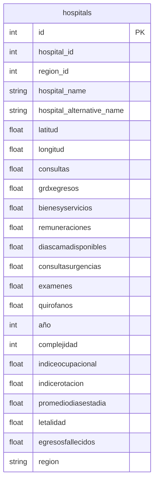

# Base de Datos

Inicialización y datos para el Panel de Eficiencia Hospitalaria.

## Contenido
- `init.sql`: script de creación de tablas y carga inicial
- `hospitals.csv`: dataset de hospitales

## Inicializar con Docker
Si usas `docker-compose.yml`, la DB se inicializa automáticamente con `init.sql` y `hospitals.csv` al levantar el servicio `db`.

```bash
docker compose up -d db
```

Variables típicas (defínelas en tu entorno): `POSTGRES_USER`, `POSTGRES_PASSWORD`, `POSTGRES_DB`, `POSTGRES_PORT`.

## Inicializar manualmente
```bash
psql -h localhost -p 5432 -U <usuario> -d <db> -f db/init.sql
```

## Diccionario de datos (resumen)
- `bienesyservicios` (int): gasto en bienes y servicios
- `remuneraciones` (int): gasto en personal
- `diascamadisponibles` (int): camas disponibles
- `consultas` (int): consultas atendidas
- `grdxegresos` (float): GRD por egresos
- `consultasurgencias` (int): consultas de urgencia
- `examenes` (float): exámenes realizados
- `quirofanos` (float): quirófanos
- `año` (int): año de referencia
- `complejidad` (int): 1=baja, 2=media, 3=alta
- `latitud`/`longitud` (float): geolocalización
- `region_id` (int): región

Consulta `docs/datos.md` para más detalle.

## Diagrama (ERD simplificado)


## Backups
- Backup: `pg_dump -h <host> -U <user> -d <db> -Fc -f backup.dump`
- Restore: `pg_restore -h <host> -U <user> -d <db> -c backup.dump`

